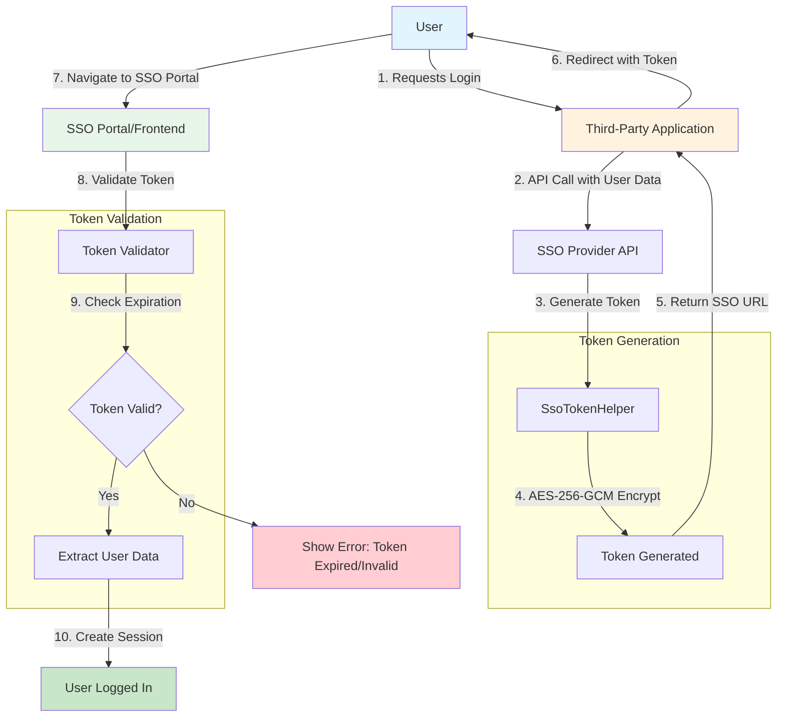

# SSO Login Integration Guide

This document provides a comprehensive guide for implementing Single Sign-On (SSO) login links to third-party applications. The SSO system uses AES-256-GCM encryption to generate secure, time-limited tokens for authentication across different platforms.

---

## Table of Contents

1. [Configuration](#1-sso-configuration)
2. [Token Generation Process](#2-token-generation-process)
3. [API Endpoint Creation](#3-api-endpoint-creation)
4. [Token Validation Implementations](#4-token-validation-implementations)
   - [PHP](#php)
   - [.NET](#net)
   - [React SPA](#react-spa)
5. [SSO Flow Diagram](#5-sso-flow-diagram)

---

## 1. Configuration

### 1.1 Environment Variables

Add the following configuration to your `.env` file:

```env
# SSO Configuration (Provided by VASP Admin)
SSO_CLIENT_SECRET=your_base64_encoded_32byte_secret_key
SSO_PORTAL_URL=https://work.vasptechnologies.com/
SSO_CLIENT_CODE=YOUR_CLIENT_CODE
```

### 1.2 Configuration Details

| Variable | Description | Required |
|----------|-------------|----------|
| `SSO_CLIENT_SECRET` | Base64-encoded 32-byte secret key for encryption | Yes |
| `SSO_PORTAL_URL` | The URL of the SSO portal/frontend application | Yes |
| `SSO_CLIENT_CODE` | Unique identifier for your application/client | Yes |


---

## 2. Token Generation Process

### 2.1 Token Structure

The SSO token uses the following format:

```
v1.{iv}.{ciphertext}.{tag}
```

Where:
- **v1** - Version identifier
- **iv** - 12-byte initialization vector (base64 URL-encoded)
- **ciphertext** - Encrypted payload (base64 URL-encoded)
- **tag** - Authentication tag for GCM mode (base64 URL-encoded)

### 2.2 Token Payload

The token contains the following claims:

```json
{
    "email": "user@example.com",
    "iat": 1699876543,
    "exp": 1699876843,
    "jti": "uuid-v4-string",
    "name": "John Doe",
    "phone": "+1234567890",
    "designation": "Manager"
}
```

| Claim | Description |
|-------|-------------|
| `email` | User's email address (required) |
| `iat` | Issued at timestamp (Unix time) |
| `exp` | Expiration timestamp (5 minutes from issue by default) |
| `jti` | Unique JWT ID for token identification |
| `name` | User's full name (optional) |
| `phone` | User's phone number (optional) |
| `designation` | User's designation/role (optional) |

### 2.3 Encryption Details

- **Algorithm**: AES-256-GCM
- **IV Length**: 12 bytes (96 bits)
- **Key**: 32 bytes (256 bits) - must be base64-encoded
- **Token Expiry**: 300 seconds (5 minutes)

---

## 3. API Endpoint Creation

### 3.1 Creating an SSO Controller

Create a new controller to handle SSO token generation:

```php
// app/Http/Controllers/SsoController.php
<?php

namespace App\Http\Controllers;

use App\Services\SsoTokenHelper;
use Illuminate\Http\Request;
use Illuminate\Http\JsonResponse;

class SsoController extends Controller
{
    public function __construct(
        private SsoTokenHelper $ssoHelper
    ) {}

    /**
     * Generate SSO login URL for a user
     * 
     * @param Request $request
     * @return JsonResponse
     */
    public function generateLoginUrl(Request $request): JsonResponse
    {
        $request->validate([
            'email' => 'required|email',
            'name' => 'nullable|string',
            'phone' => 'nullable|string',
            'designation' => 'nullable|string',
        ]);

        try {
            $clientCode = config('services.sso.client_code');
            
            $ssoUrl = $this->ssoHelper->generateSsoUrl(
                clientCode: $clientCode,
                email: $request->input('email'),
                name: $request->input('name'),
                phone: $request->input('phone'),
                designation: $request->input('designation')
            );

            return response()->json([
                'success' => true,
                'url' => $ssoUrl,
                'expires_in' => 300
            ]);
        } catch (\RuntimeException $e) {
            return response()->json([
                'success' => false,
                'message' => $e->getMessage()
            ], 500);
        }
    }
}
```

### 3.2 Registering Routes

Add the route to your `routes/api.php` or `routes/web.php`:

```php
// routes/api.php
use App\Http\Controllers\SsoController;

Route::post('/sso/generate-url', [SsoController::class, 'generateLoginUrl']);
```

### 3.3 Example API Request

```bash
# Request
curl -X POST https://clientwebsite.com/api/sso/generate-url \
  -H "Content-Type: application/json" \
  -d '{
    "email": "user@example.com",
    "name": "John Doe",
    "phone": "+1234567890",
    "designation": "Manager"
  }'

# Response
{
  "success": true,
  "url": "https://work.vasptechnologies.com/s/RSCTRANST?token=v1.abc123.def456.ghi789",
  "expires_in": 300
}
```

---

## 4. Token Validation Implementations

### PHP

```php
<?php

namespace App\Services;

use Illuminate\Support\Str;

class SsoTokenValidator
{
    private string $secret;

    public function __construct(string $secret)
    {
        $this->secret = $secret;
    }

    /**
     * Validate and decode an SSO token
     * 
     * @param string $token
     * @return array|null Returns payload array or null if invalid
     */
    public function validateToken(string $token): ?array
    {
        try {
            // Parse token format: v1.{iv}.{ciphertext}.{tag}
            $parts = explode('.', $token);
            
            if (count($parts) !== 4 || $parts[0] !== 'v1') {
                return null;
            }

            [$version, $ivBase64, $ciphertextBase64, $tagBase64] = $parts;

            // Decode base64 URL encoding
            $iv = $this->base64UrlDecode($ivBase64);
            $ciphertext = $this->base64UrlDecode($ciphertextBase64);
            $tag = $this->base64UrlDecode($tagBase64);

            if (strlen($iv) !== 12) {
                return null;
            }

            // Derive key from secret
            $key = $this->deriveKey();

            // Decrypt
            $decrypted = openssl_decrypt(
                $ciphertext,
                'aes-256-gcm',
                $key,
                OPENSSL_RAW_DATA,
                $iv,
                $tag
            );

            if ($decrypted === false) {
                return null;
            }

            $payload = json_decode($decrypted, true);

            // Validate expiration
            if (!isset($payload['exp']) || $payload['exp'] < time()) {
                return null;
            }

            return $payload;

        } catch (\Exception $e) {
            return null;
        }
    }

    /**
     * Check if token is expired without full validation
     * 
     * @param string $token
     * @return bool
     */
    public function isTokenExpired(string $token): bool
    {
        $payload = $this->validateToken($token);
        return $payload === null || $payload['exp'] < time();
    }

    private function deriveKey(): string
    {
        $rawKey = base64_decode($this->secret, true);
        
        if ($rawKey === false) {
            throw new \RuntimeException('Invalid SSO secret key.');
        }

        if (strlen($rawKey) !== 32) {
            throw new \RuntimeException('SSO secret must be a base64-encoded 32-byte key.');
        }

        return $rawKey;
    }

    private function base64UrlDecode(string $value): string
    {
        return base64_decode(strtr($value, '-_', '+/'));
    }
}

// Usage Example:
$validator = new SsoTokenValidator('your_base64_secret_key');
$payload = $validator->validateToken($token);

if ($payload) {
    echo "User email: " . $payload['email'];
    echo "Name: " . ($payload['name'] ?? 'N/A');
} else {
    echo "Invalid or expired token";
}
```

---

### .NET (C#)

```csharp
using System;
using System.Security.Cryptography;
using System.Text;
using System.Text.Json;

namespace SSOValidation
{
    public class SsoTokenValidator
    {
        private readonly byte[] _secretKey;

        public SsoTokenValidator(string base64Secret)
        {
            _secretKey = Convert.FromBase64String(base64Secret);
            
            if (_secretKey.Length != 32)
            {
                throw new ArgumentException("SSO secret must be a base64-encoded 32-byte key.");
            }
        }

        /// <summary>
        /// Validates and decodes an SSO token
        /// </summary>
        /// <param name="token">The SSO token string</param>
        /// <returns>Payload dictionary or null if invalid</returns>
        public Dictionary<string, object?> ValidateToken(string token)
        {
            try
            {
                // Parse token format: v1.{iv}.{ciphertext}.{tag}
                var parts = token.Split('.');
                
                if (parts.Length != 4 || parts[0] != "v1")
                {
                    return null;
                }

                var iv = Base64UrlDecode(parts[1]);
                var ciphertext = Base64UrlDecode(parts[2]);
                var tag = Base64UrlDecode(parts[3]);

                if (iv.Length != 12)
                {
                    return null;
                }

                // Decrypt using AES-256-GCM
                var decrypted = DecryptAesGcm(ciphertext, iv, tag);
                
                if (decrypted == null)
                {
                    return null;
                }

                var payload = JsonSerializer.Deserialize<Dictionary<string, object>>(
                    decrypted, 
                    new JsonSerializerOptions { PropertyNameCaseInsensitive = true }
                );

                // Validate expiration
                if (payload == null || !payload.ContainsKey("exp"))
                {
                    return null;
                }

                var expTime = Convert.ToInt64(payload["exp"]);
                if (expTime < DateTimeOffset.UtcNow.ToUnixTimeSeconds())
                {
                    return null;
                }

                return payload;
            }
            catch
            {
                return null;
            }
        }

        private byte[] DecryptAesGcm(byte[] ciphertext, byte[] iv, byte[] tag)
        {
            using var aesGcm = new AesGcm(_secretKey, 16);
            var plaintext = new byte[ciphertext.Length];
            
            try
            {
                aesGcm.Decrypt(iv, ciphertext, tag, plaintext);
                return plaintext;
            }
            catch
            {
                return null;
            }
        }

        private byte[] Base64UrlDecode(string value)
        {
            var base64 = value.Replace('-', '+').Replace('_', '/');
            
            switch (base64.Length % 4)
            {
                case 2: base64 += "=="; break;
                case 3: base64 += "="; break;
            }
            
            return Convert.FromBase64String(base64);
        }
    }

    // Usage Example:
    // var validator = new SsoTokenValidator("your_base64_secret_key");
    // var payload = validator.ValidateToken(token);
    // 
    // if (payload != null)
    // {
    //     Console.WriteLine($"User email: {payload["email"]}");
    //     Console.WriteLine($"Name: {payload["name"] ?? "N/A"}");
    // }
    // else
    // {
    //     Console.WriteLine("Invalid or expired token");
    // }
}
```

---

### React SPA

```javascript
// ssoTokenValidator.js

/**
 * SSO Token Validator for React/JavaScript
 * Uses Web Crypto API for AES-GCM decryption
 */

class SsoTokenValidator {
  constructor(base64Secret) {
    this.secretKey = null;
    this._initializeKey(base64Secret);
  }

  async _initializeKey(base64Secret) {
    // Decode base64 secret
    const secretBytes = this._base64UrlDecode(base64Secret);
    
    if (secretBytes.length !== 32) {
      throw new Error('SSO secret must be a base64-encoded 32-byte key');
    }

    // Import the key for AES-GCM
    this.secretKey = await crypto.subtle.importKey(
      'raw',
      secretBytes,
      { name: 'AES-GCM', length: 256 },
      false,
      ['decrypt']
    );
  }

  /**
   * Validate and decode an SSO token
   * @param {string} token - The SSO token string
   * @returns {Promise<Object|null>} - Payload object or null if invalid
   */
  async validateToken(token) {
    try {
      // Parse token format: v1.{iv}.{ciphertext}.{tag}
      const parts = token.split('.');
      
      if (parts.length !== 4 || parts[0] !== 'v1') {
        return null;
      }

      const [version, ivBase64, ciphertextBase64, tagBase64] = parts;

      // Decode base64 URL encoding
      const iv = this._base64UrlDecode(ivBase64);
      const ciphertext = this._base64UrlDecode(ciphertextBase64);
      const tag = this._base64UrlDecode(tagBase64);

      if (iv.length !== 12) {
        return null;
      }

      // Combine ciphertext and tag for AES-GCM
      const ciphertextWithTag = new Uint8Array(ciphertext.length + tag.length);
      ciphertextWithTag.set(ciphertext);
      ciphertextWithTag.set(tag, ciphertext.length);

      // Decrypt
      const decryptedBuffer = await crypto.subtle.decrypt(
        { name: 'AES-GCM', iv: iv },
        this.secretKey,
        ciphertextWithTag
      );

      const decoder = new TextDecoder();
      const decrypted = decoder.decode(decryptedBuffer);
      
      const payload = JSON.parse(decrypted);

      // Validate expiration
      if (!payload.exp || payload.exp < Math.floor(Date.now() / 1000)) {
        return null;
      }

      return payload;

    } catch (error) {
      console.error('Token validation error:', error);
      return null;
    }
  }

  /**
   * Check if token is expired
   * @param {string} token - The SSO token string
   * @returns {Promise<boolean>}
   */
  async isTokenExpired(token) {
    const payload = await this.validateToken(token);
    return payload === null || payload.exp < Math.floor(Date.now() / 1000);
  }

  _base64UrlDecode(value) {
    // Convert base64url to base64
    let base64 = value.replace(/-/g, '+').replace(/_/g, '/');
    
    // Add padding if needed
    const padding = base64.length % 4;
    if (padding) {
      base64 += '='.repeat(4 - padding);
    }

    // Decode
    const binaryString = atob(base64);
    const bytes = new Uint8Array(binaryString.length);
    for (let i = 0; i < binaryString.length; i++) {
      bytes[i] = binaryString.charCodeAt(i);
    }
    return bytes;
  }
}

// Export for use in React components
export default SsoTokenValidator;

// React Hook Example:
/*
import { useState, useEffect } from 'react';
import SsoTokenValidator from './ssoTokenValidator';

function useSsoValidation(token, secret) {
  const [payload, setPayload] = useState(null);
  const [isValid, setIsValid] = useState(false);
  const [isLoading, setIsLoading] = useState(true);

  useEffect(() => {
    async function validate() {
      if (!token || !secret) {
        setIsValid(false);
        setIsLoading(false);
        return;
      }

      const validator = new SsoTokenValidator(secret);
      const result = await validator.validateToken(token);
      
      setPayload(result);
      setIsValid(result !== null);
      setIsLoading(false);
    }

    validate();
  }, [token, secret]);

  return { payload, isValid, isLoading };
}

// Usage in component:
function LoginCallback() {
  const params = new URLSearchParams(window.location.search);
  const token = params.get('token');
  const secret = 'your_base64_secret_key'; // Store securely!
  
  const { payload, isValid, isLoading } = useSsoValidation(token, secret);

  if (isLoading) {
    return <div>Validating token...</div>;
  }

  if (!isValid) {
    return <div>Invalid or expired token</div>;
  }

  return (
    <div>
      <h1>Welcome, {payload.name}!</h1>
      <p>Email: {payload.email}</p>
      <p>Designation: {payload.designation}</p>
    </div>
  );
}
*/
```

---

## 5. SSO Flow Diagram



### Flow Description

1. **User Request**: User clicks on a third-party application link that requires SSO login
2. **API Call**: The third-party application calls the SSO provider API with user credentials/identifier
3. **Token Generation**: The SsoTokenHelper generates an encrypted token using AES-256-GCM
4. **Encryption**: The token payload (email, name, expiration, etc.) is encrypted
5. **Return URL**: The SSO provider returns a complete URL with the encrypted token
6. **Redirect**: The third-party application redirects the user to the SSO portal URL
7. **Navigation**: User's browser navigates to the SSO portal with the token as a query parameter
8. **Validation**: The SSO portal validates the token using the appropriate platform validator
9. **Expiration Check**: The validator checks if the token has expired
10. **Session Creation**: If valid, the user is logged in and a session is created

---

## Security Considerations

1. **Token Expiry**: Tokens expire after 5 minutes (300 seconds) - ensure quick redirect
2. **HTTPS Only**: Always use HTTPS in production
3. **Secret Key Management**: Store the client secret securely, never expose in client-side code
4. **Token One-Time Use**: Each token should be used only once
5. **IP Binding** (Optional): Consider binding tokens to IP addresses for additional security

---

## Troubleshooting

| Issue | Solution |
|-------|----------|
| Invalid token error | Verify the secret key matches exactly on both sides |
| Token expired error | Ensure the token is used within 5 minutes of generation |
| Decryption failed | Check that the same AES-256-GCM algorithm is used |
| Base64 decoding error | Ensure consistent base64url encoding/decoding |

---

## References

- [SsoTokenHelper.php](app/Services/SsoTokenHelper.php) - Original implementation
- [config/services.php](config/services.php) - Configuration reference
- [AES-GCM Encryption](https://en.wikipedia.org/wiki/Galois/Counter_Mode) - Encryption algorithm details
