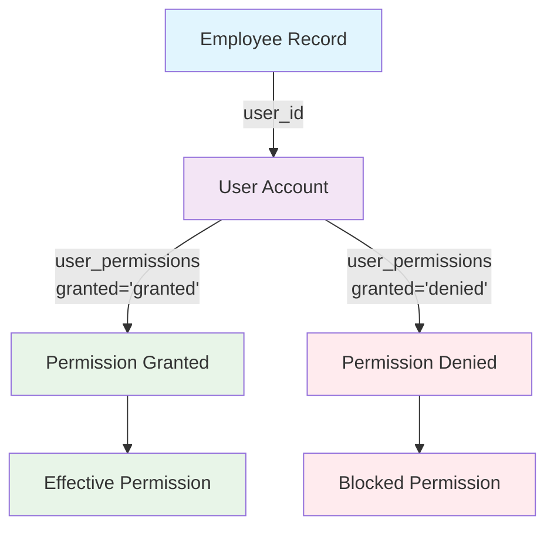
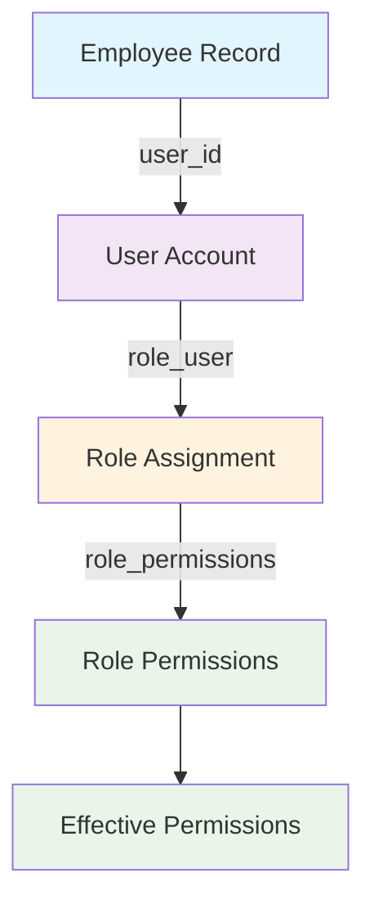
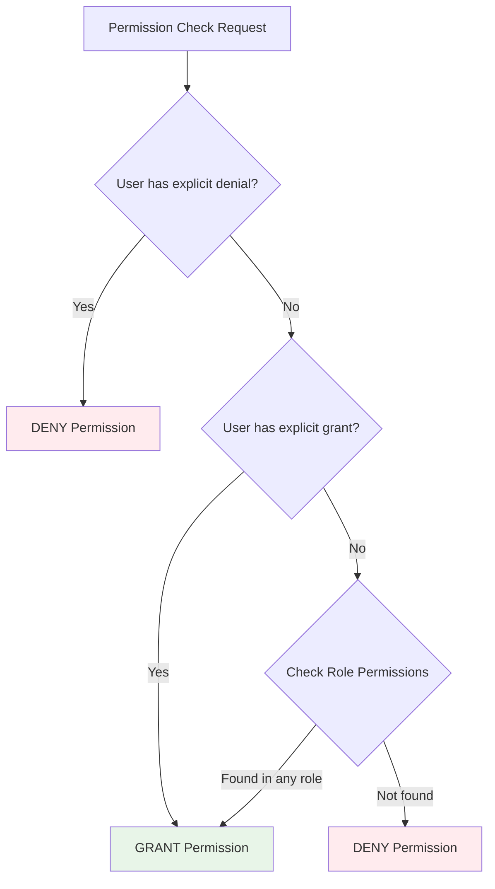
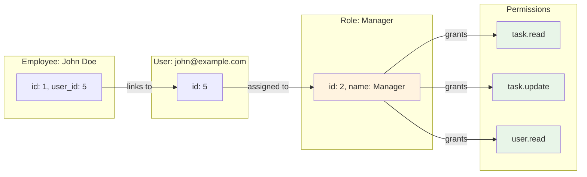
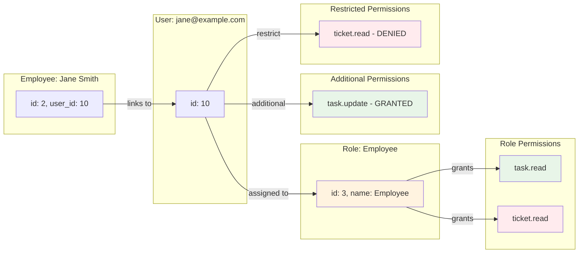

# Employee-User-Role-Permission Flow Diagram

## Entity Relationship Diagram

```mermaid
erDiagram
    EMPLOYEES ||--|| USERS : has
    USERS ||--o{ ROLE_USER : assigned_to
    ROLES ||--o{ ROLE_USER : has
    ROLES ||--o{ ROLE_PERMISSIONS : grants
    PERMISSIONS ||--o{ ROLE_PERMISSIONS : assigned_to
    USERS ||--o{ USER_PERMISSIONS : overrides
    PERMISSIONS ||--o{ USER_PERMISSIONS : overridden_for
    
    EMPLOYEES {
        id PK
        name
        email
        phone
        user_id FK
        department_id FK
        status
    }
    
    USERS {
        id PK
        name
        email
        password
        email_verified_at
        created_at
        updated_at
    }
    
    ROLES {
        id PK
        name
        slug
        description
        level
        is_default
    }
    
    PERMISSIONS {
        id PK
        name
        slug
        module
        action
        description
    }
    
    ROLE_USER {
        id PK
        role_id FK
        user_id FK
        created_at
        updated_at
    }
    
    ROLE_PERMISSIONS {
        id PK
        role_id FK
        permission_id FK
        created_at
        updated_at
    }
    
    USER_PERMISSIONS {
        id PK
        user_id FK
        permission_id FK
        granted
        created_at
        updated_at
    }
```

## Permission Flow Diagrams

### Flow 1: Employee → User → Permission (Override Flow)



### Flow 2: Employee → User → Role → Permission (Inheritance Flow)



## Complete Permission Resolution Flow



## Data Flow Examples

### Example 1: Role-Based Only



### Example 2: Role + Overrides



**Calculation**:
- **Role Permissions**: 2 (task.read, ticket.read)
- **Additional**: 1 (task.update)  
- **Restricted**: 1 (ticket.read)
- **Effective Total**: (2 - 1) + 1 = 2 permissions
- **Final Permissions**: [task.read, task.update]

## Query Patterns

### Get User's Effective Permissions

```sql
-- Step 1: Get role-based permissions (minus denied)
SELECT DISTINCT p.*
FROM permissions p
JOIN role_permissions rp ON p.id = rp.permission_id
JOIN role_user ru ON rp.role_id = ru.role_id
WHERE ru.user_id = :user_id
AND p.id NOT IN (
    SELECT permission_id 
    FROM user_permissions 
    WHERE user_id = :user_id AND granted = 'denied'
)

UNION

-- Step 2: Get explicitly granted user permissions
SELECT DISTINCT p.*
FROM permissions p
JOIN user_permissions up ON p.id = up.permission_id
WHERE up.user_id = :user_id AND up.granted = 'granted';
```

### Check Specific Permission

```php
public function hasPermission($permissionSlug): bool
{
    $user = $this;
    $permission = Permission::where('slug', $permissionSlug)->first();
    
    if (!$permission) return false;
    
    // Priority 1: Explicit denial
    if ($user->deniedPermissions()->where('permission_id', $permission->id)->exists()) {
        return false;
    }
    
    // Priority 2: Explicit grant
    if ($user->permissions()->where('permission_id', $permission->id)->exists()) {
        return true;
    }
    
    // Priority 3: Role-based
    foreach ($user->roles as $role) {
        if ($role->permissions()->where('permission_id', $permission->id)->exists()) {
            return true;
        }
    }
    
    return false;
}
```

## API Endpoints and Data Flow

### Employee List API Response

```json
{
  "employees": {
    "data": [
      {
        "id": 1,
        "name": "John Doe",
        "email": "john@example.com",
        "department": {
          "id": 1,
          "name": "IT Department"
        },
        "user": {
          "id": 5,
          "role": {
            "id": 2,
            "name": "Manager"
          },
          "role_permissions": [
            {
              "id": 1,
              "name": "Read Tasks",
              "slug": "task.read",
              "module": "task"
            },
            {
              "id": 2,
              "name": "Update Tasks", 
              "slug": "task.update",
              "module": "task"
            }
          ],
          "additional_permissions": [],
          "denied_permissions": []
        }
      }
    ]
  }
}
```

### Permission Summary Calculation (Frontend)

```javascript
// Calculate effective permissions for display
function calculatePermissionSummary(user) {
    const rolePermissions = user.role_permissions || [];
    const additionalPermissions = user.additional_permissions || [];
    const restrictedPermissions = user.denied_permissions || [];
    
    // Formula: (Role Permissions - Restricted Role Permissions) + Additional Permissions
    const effectiveRolePermissions = rolePermissions.filter(
        permission => !restrictedPermissions.includes(permission.slug)
    );
    
    const totalEffectivePermissions = [
        ...effectiveRolePermissions,
        ...additionalPermissions
    ];
    
    return {
        roleBased: rolePermissions.length,
        additional: additionalPermissions.length,
        restricted: restrictedPermissions.length,
        effectiveTotal: totalEffectivePermissions.length,
        effectivePermissions: totalEffectivePermissions
    };
}
```

**Permission Formula**:
```
Total Effective Permissions = (Role Permissions - Restricted Role Permissions) + Additional Permissions
```

## Summary

The permission system uses a **hybrid RBAC model** with override capabilities:

- **Base Layer**: Role-based permissions provide default access
- **Override Layer**: User-level permissions can grant or deny specific permissions  
- **Resolution Logic**: Denials > Grants > Role Permissions > No Access

This design provides flexibility for fine-grained permission management while maintaining role-based organization for scalability.