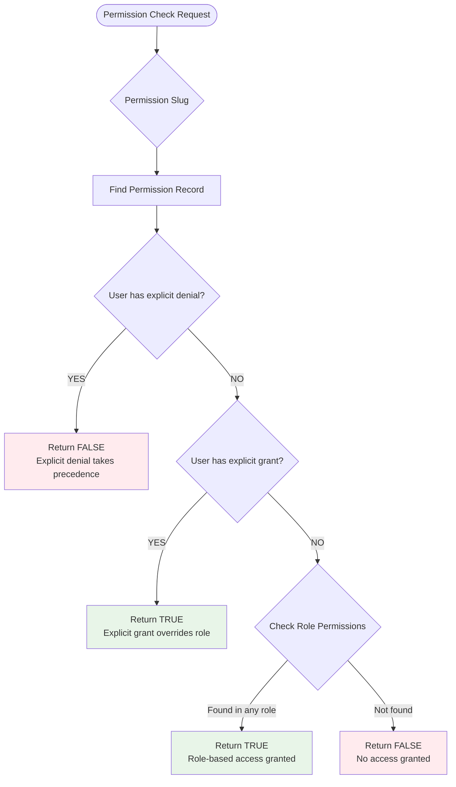

# Employee-User-Role-Permission System Architecture

## System Overview

The employee permission system implements a **Hybrid Role-Based Access Control (RBAC)** model with granular override capabilities. This design allows for both structured role-based permission inheritance and fine-grained user-level permission management.

## Architecture Diagram

```mermaid
graph TB
    subgraph "Business Layer"
        E[Employee]
        D[Department]
    end
    
    subgraph "Authentication Layer" 
        U[User Account]
    end
    
    subgraph "Authorization Layer"
        R[Role]
        P[Permission]
    end
    
    subgraph "Override System"
        UP[User Permissions<br/>Override Table]
    end
    
    %% Primary Relationships
    E -->|1:1| U
    E -->|N:1| D
    
    %% Role-Based Access
    U -->|N:M| R
    R -->|N:M| P
    
    %% Override System
    U -->|N:M| UP
    UP -->|granted/denied| P
    
    %% Permission Resolution Flow
    U -->|Permission Check| PR{Permission Resolution}
    PR -->|Denied| X[DENY ACCESS]
    PR -->|Granted| ✓[GRANT ACCESS]
    PR -->|From Role| P
    
    style E fill:#e3f2fd
    style U fill:#f3e5f5
    style R fill:#fff3e0
    style P fill:#e8f5e8
    style UP fill:#fce4ec
    style X fill:#ffebee
    style ✓ fill:#e8f5e8
```

## Data Flow Architecture

```mermaid
flowchart LR
    subgraph "Frontend (React)"
        EI[Employee Index]
        EE[Employee Edit]
        EF[Employee Form]
    end
    
    subgraph "API Layer"
        EC[Employee Controller]
        AC[Authorization Check]
    end
    
    subgraph "Business Logic"
        UM[User Model]
        RM[Role Model]
        PM[Permission Model]
    end
    
    subgraph "Database"
        EMP[employees]
        USR[users]
        ROL[roles]
        PER[permissions]
        RUP[role_user]
        RPE[role_permissions]
        UPE[user_permissions]
    end
    
    %% Frontend to API
    EI -->|GET /employees| EC
    EE -->|GET /employees/{id}/edit| EC
    EF -->|PUT/PATCH /employees/{id}| EC
    
    %% API to Authorization
    EC --> AC
    
    %% Authorization to Models
    AC --> UM
    AC --> RM
    AC --> PM
    
    %% Models to Database
    UM --> EMP
    UM --> USR
    RM --> ROL
    PM --> PER
    
    %% Relationship Queries
    UM -->|eager loading| RUP
    RM -->|permissions| RPE
    UM -->|overrides| UPE
    
    style EI fill:#e1f5fe
    style EE fill:#e1f5fe
    style EF fill:#e1f5fe
    style EC fill:#fff3e0
    style AC fill:#fce4ec
    style UM fill:#e8f5e8
    style RM fill:#e8f5e8
    style PM fill:#e8f5e8
```

## Permission Resolution Algorithm



## Database Schema

### Core Tables

```sql
-- Employees (Business Entity)
CREATE TABLE employees (
    id BIGINT PRIMARY KEY,
    name VARCHAR(255) NOT NULL,
    email VARCHAR(255),
    phone VARCHAR(20),
    user_id BIGINT REFERENCES users(id) ON DELETE SET NULL,
    department_id BIGINT REFERENCES departments(id) ON DELETE CASCADE,
    status ENUM('active', 'inactive', 'on_leave', 'terminated'),
    created_at TIMESTAMP,
    updated_at TIMESTAMP
);

-- Users (Authentication)
CREATE TABLE users (
    id BIGINT PRIMARY KEY,
    name VARCHAR(255) NOT NULL,
    email VARCHAR(255) UNIQUE NOT NULL,
    password VARCHAR(255) NOT NULL,
    email_verified_at TIMESTAMP,
    created_at TIMESTAMP,
    updated_at TIMESTAMP
);

-- Roles (Permission Groups)
CREATE TABLE roles (
    id BIGINT PRIMARY KEY,
    name VARCHAR(255) UNIQUE NOT NULL,
    slug VARCHAR(255) UNIQUE NOT NULL,
    description TEXT,
    level INTEGER DEFAULT 1,
    is_default BOOLEAN DEFAULT FALSE,
    created_at TIMESTAMP,
    updated_at TIMESTAMP
);

-- Permissions (Granular Access Control)
CREATE TABLE permissions (
    id BIGINT PRIMARY KEY,
    name VARCHAR(255) UNIQUE NOT NULL,
    slug VARCHAR(255) UNIQUE NOT NULL,
    module VARCHAR(50) NOT NULL, -- 'task', 'user', 'employee', etc.
    action VARCHAR(50) NOT NULL, -- 'create', 'read', 'update', 'delete'
    description TEXT,
    created_at TIMESTAMP,
    updated_at TIMESTAMP
);

-- Role-User Relationship (Many-to-Many)
CREATE TABLE role_user (
    id BIGINT PRIMARY KEY,
    role_id BIGINT NOT NULL REFERENCES roles(id) ON DELETE CASCADE,
    user_id BIGINT NOT NULL REFERENCES users(id) ON DELETE CASCADE,
    created_at TIMESTAMP,
    updated_at TIMESTAMP,
    UNIQUE(role_id, user_id)
);

-- Role-Permissions Relationship (Many-to-Many)
CREATE TABLE role_permissions (
    id BIGINT PRIMARY KEY,
    role_id BIGINT NOT NULL REFERENCES roles(id) ON DELETE CASCADE,
    permission_id BIGINT NOT NULL REFERENCES permissions(id) ON DELETE CASCADE,
    created_at TIMESTAMP,
    updated_at TIMESTAMP,
    UNIQUE(role_id, permission_id)
);

-- User Permission Overrides (Granular Control)
CREATE TABLE user_permissions (
    id BIGINT PRIMARY KEY,
    user_id BIGINT NOT NULL REFERENCES users(id) ON DELETE CASCADE,
    permission_id BIGINT NOT NULL REFERENCES permissions(id) ON DELETE CASCADE,
    granted ENUM('granted', 'denied') NOT NULL,
    created_at TIMESTAMP,
    updated_at TIMESTAMP,
    UNIQUE(user_id, permission_id)
);
```

## Indexes for Performance

```sql
-- Primary relationship indexes
CREATE INDEX idx_employees_user_id ON employees(user_id);
CREATE INDEX idx_employees_department_id ON employees(department_id);
CREATE INDEX idx_role_user_user_id ON role_user(user_id);
CREATE INDEX idx_role_user_role_id ON role_user(role_id);
CREATE INDEX idx_role_permissions_role_id ON role_permissions(role_id);
CREATE INDEX idx_role_permissions_permission_id ON role_permissions(permission_id);
CREATE INDEX idx_user_permissions_user_id ON user_permissions(user_id);
CREATE INDEX idx_user_permissions_permission_id ON user_permissions(permission_id);
CREATE INDEX idx_user_permissions_granted ON user_permissions(user_id, granted);

-- Composite indexes for common queries
CREATE INDEX idx_user_permissions_lookup ON user_permissions(user_id, permission_id, granted);
```

## API Design Patterns

### Employee List Endpoint

```http
GET /admin/employees
```

**Response Structure**:
```json
{
  "employees": {
    "data": [
      {
        "id": 1,
        "name": "John Doe",
        "email": "john@example.com",
        "department": {
          "id": 1,
          "name": "IT Department"
        },
        "user": {
          "id": 5,
          "role": {
            "id": 2,
            "name": "Manager"
          },
          "role_permissions": [
            {
              "id": 1,
              "name": "Read Tasks",
              "slug": "task.read",
              "module": "task"
            }
          ],
          "additional_permissions": [],
          "denied_permissions": []
        }
      }
    ],
    "current_page": 1,
    "last_page": 5,
    "total": 47
  }
}
```

### Permission Check Middleware

```php
class CheckPermission
{
    public function handle($request, Closure $next, $permission)
    {
        $user = auth()->user();
        
        if (!$user->hasPermission($permission)) {
            abort(403, 'Insufficient permissions');
        }
        
        return $next($request);
    }
}
```

## Security Model

### Permission Precedence Rules

1. **Explicit User Denial** (Highest Priority)
   - Blocked even if role grants it
   - Used for temporary restrictions or compliance

2. **Explicit User Grant** (Second Priority)  
   - Granted even if role doesn't include it
   - Used for special cases or exceptions

3. **Role-Based Permission** (Base Level)
   - Inherited from assigned roles
   - Primary permission mechanism

4. **No Permission** (Default)
   - Access denied
   - No implicit grants

### Data Integrity Constraints

```sql
-- Prevent circular role assignments
ALTER TABLE roles ADD CONSTRAINT chk_role_level 
CHECK (level >= 1);

-- Ensure unique permission slugs per module+action
ALTER TABLE permissions ADD CONSTRAINT uq_permission_module_action 
UNIQUE(module, action);

-- Prevent users from denying their own critical permissions
ALTER TABLE user_permissions ADD CONSTRAINT chk_no_self_denial 
CHECK (granted != 'denied' OR permission_id NOT IN (
    SELECT id FROM permissions WHERE module = 'user' AND action = 'delete'
));
```

## Scalability Considerations

### Performance Optimization

1. **Eager Loading**
   ```php
   Employee::with([
       'department', 
       'user.roles.permissions',
       'user.permissions',
       'user.deniedPermissions'
   ])->paginate(15);
   ```

2. **Permission Caching**
   ```php
   // Cache user's effective permissions for 1 hour
   $permissions = Cache::remember(
       "user_permissions_{$user->id}",
       3600,
       fn() => $user->getAllPermissions()->pluck('slug')->toArray()
   );
   ```

3. **Database Optimization**
   - Proper indexing on all foreign keys
   - Query optimization for permission checks
   - Connection pooling for high concurrency

### Horizontal Scaling

1. **Read Replicas**
   - Use replicas for permission queries
   - Keep writes on primary database

2. **Cache Layer**
   - Redis for permission cache
   - Cache invalidation on permission changes

3. **Microservices**
   - Separate user management service
   - Event-driven permission updates

## Monitoring and Auditing

### Key Metrics

1. **Permission Check Performance**
   - Average response time
   - Cache hit rates
   - Database query counts

2. **Access Patterns**
   - Most frequently checked permissions
   - Role usage statistics
   - Override patterns

3. **Security Events**
   - Permission denials
   - Unauthorized access attempts
   - Privilege escalation patterns

### Audit Trail

```php
// Log permission changes
Log::info('Permission updated', [
    'user_id' => $user->id,
    'permission_id' => $permission->id,
    'action' => $action,
    'granted' => $granted,
    'changed_by' => auth()->id(),
    'timestamp' => now()
]);
```

## Summary

This architecture provides:

### Permission Calculation Formula
```
Total Effective Permissions = (Role-based permissions + Additional permissions) - Restricted permissions
```

### System Benefits
- **Flexibility**: Role-based with granular overrides
- **Security**: Multiple layers of access control
- **Performance**: Optimized queries and caching
- **Scalability**: Designed for growth and distribution
- **Maintainability**: Clear separation of concerns
- **Auditability**: Complete trail of permission changes

The system successfully balances simplicity (roles) with flexibility (overrides) while maintaining security and performance at scale, following the clear calculation: **Role + Additional - Restricted**.